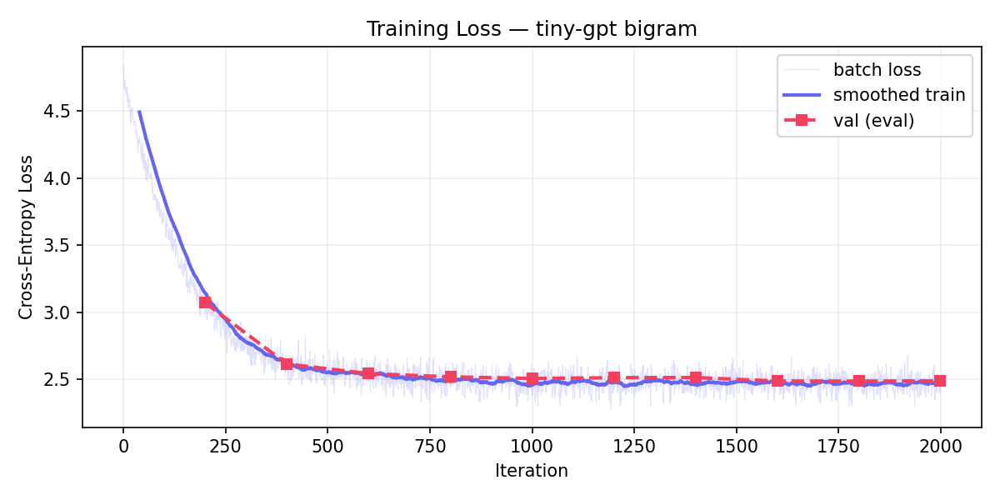

# tiny-gpt

A from-scratch GPT implementation in PyTorch, with ablation studies. **Work in progress** — see roadmap below.

[](LICENSE)

> **Status: Week 1 of 6 — bigram baseline ✅**
> Currently: implementing scaled dot-product + multi-head attention.

## Why this exists

I want to understand the GPT architecture by building it, not by reading about it. The companion project [tiny-autograd](https://github.com/Vishnu1837/tiny-autograd) implements reverse-mode autodiff and trains an MLP on MNIST in ~600 lines of NumPy — once `.backward()` is no longer magic, attention shouldn't be either. This repo takes that one level up: a small transformer, trained on a personal corpus, with a battery of ablations to make the architectural decisions concrete.

The goal isn't to compete with anything. The goal is that, six weeks from now, I should be able to whiteboard the data path through a transformer block from memory, derive why pre-norm trains more stably than post-norm, and explain what each ablation in the table cost or bought.

## What's working

A character-level **bigram baseline** trains end-to-end on TinyShakespeare in ~4 seconds on CPU. This is the scaffolding — the data pipeline, training loop, sampling, and config plumbing — verified before any attention machinery lands.



```
iter     0  loss=4.5031  lr=1.00e-02
iter   500  loss=2.4831  lr=8.55e-03
iter  1000  loss=2.4641  lr=5.05e-03
iter  1500  loss=2.4196  lr=1.99e-03
iter  1999  loss=2.4566  lr=1.00e-03

[final eval @ iter 1999]  train=2.47  val=2.49  (3.7s total)
```

Loss drops from `log(65) = 4.17` (uniform over the 65-char vocabulary) to `~2.47`, which is the entropy ceiling for any model that conditions only on the previous character. Train and val track each other — a 4,225-parameter lookup table can't overfit 1MB of text.

Sample after training (`python sample.py "ROMEO:" --max-new 200 --top-k 10`):

```
ROMEO:
I t mer an wiesail, benend w ounssththishit t bet ishal a ho ffe hondour
o he iso thowe finirt whotourds byomysounor m,
The od wnck tha tishthal heainca w iconcet avotelouserereaires, hongry
ber an i
```

Correct character-level statistics — capital letters after newlines, frequent `:` after speaker tags, plausible bigrams (`th`, `he`, `ou`) — and zero word-level coherence, because a bigram has no context. That's the bar. **If a transformer can't do better than this, it's broken.**

## Roadmap

- [x] **Week 1** — Data pipeline, char tokenizer, bigram baseline, training loop with cosine LR
- [ ] **Week 2** — Scaled dot-product attention, multi-head attention, causal mask, single transformer block (pre-norm), overfit-tiny-batch sanity check, parity test against `torch.nn.MultiheadAttention`
- [ ] **Week 3** — Stack into a full GPT (~10–15M params), train on TinyShakespeare to coherent generation, BPE tokenizer
- [ ] **Week 4** — Ablation grid: pre-norm vs post-norm, ±residuals, ±LayerNorm, learned vs sinusoidal vs RoPE position, head-count sweep, tied vs untied embeddings
- [ ] **Week 5** — Final training run on a personal corpus (TBD), longer-context generation, sampling controls (top-k, top-p, temperature)
- [ ] **Week 6** — Write up the results as a blog post; clean up the repo for portfolio use

The week numbers are notional. I'd rather ship Week 2 well than rush all six.

## Project Structure

```
config.py     — GPTConfig + TrainConfig dataclasses (single source of truth)
tokenizer.py  — Character-level tokenizer with save/load
data.py       — TinyShakespeare downloader + windowed Dataset
models.py     — Model registry; BigramLM (Week 1), GPT lands in Week 2
train.py      — Training loop with linear-warmup + cosine-decay LR
sample.py     — Load a checkpoint and generate
```

Ablation toggles live as fields on `GPTConfig` (`norm_position`, `pos_encoding`, `use_residual`, `use_layernorm`, `tie_embeddings`) so each Week-4 experiment is one field flip on a config instance, not a code edit.

## Quick Start

```bash
git clone https://github.com/Vishnu1837/tiny-gpt.git
cd tiny-gpt
pip install -r requirements.txt --extra-index-url https://download.pytorch.org/whl/cpu

# Train the bigram baseline on TinyShakespeare (~4 seconds on CPU)
python train.py

# Generate from the trained checkpoint
python sample.py "ROMEO:" --max-new 500 --top-k 10
```

## License

[MIT](LICENSE)
